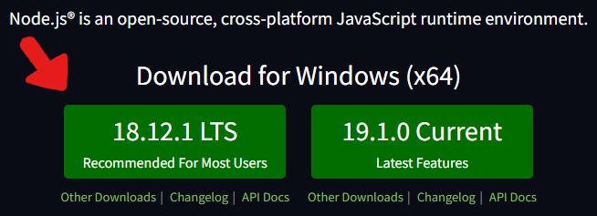
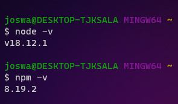
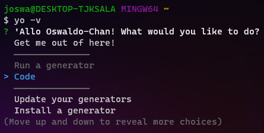

# Extensiones en VS Code
Aprenderemos sobre el desarrollo de extensiones de VS Code y crearemos una con la ayuda de la [Extension API](https://code.visualstudio.com/api) de VS Code. Esta extensión nos permitirá crear Snnipets en el editor para reutilizar código y recomendar atajos para un autocompletado del código.

### Contenidos de la sesión:

- [Instalación de los **requisitos**](#requisitos)
- [**Anatomía** de una extensión](#anatomia)
- [Cómo añadir un **nuevo comando**](#nuevo-comando)
- [Crea tu **primera extensión**](#practica)

------------

## <a name="requisitos">Requisitos previos</a> [&#8593;](#extensiones-en-vs-code)

### Requisitos para crear una extensión
Antes de comenzar, asegúrate de tener instalar estos requisitos.

- Instalar [Node.js y NPM](#instalacion-1)
- Instalar [Yo y Generator code](#instalacion-2)

#### <a name="instalacion-1">Instalación de Node.js y NPM</a>

Para instalar Node.js y NPM solo basta con descargar el paquete de instalación [AQUÍ](https://nodejs.org/en/) y luego ejecutarlo.

<p align="center">
    
</p>
Para corroborar que ambos ya se encuentran instalados, introduce los siguientes comandos para conocer la versión de cada uno.

`node -v`

`npm -v`

<p align="center">
    
</p>

#### <a name="instalacion-2">Instalación de Yo y Generator code</a>

Para instalar estos dos paquetes introduce el siguiente comando en tu terminal y luego presiona **Enter**.

```text
npm install -g yo generator-code
```
Para saber que se instaló correctamente, introduce el siguiente comando.

`yo -v`

<p align="center">
    
</p>

¡Listo! ya tienes lo necesario para crear una extensión.

------------

## <a name="anatomia">Anatomía de una extensión</a> [&#8593;](#extensiones-en-vs-code)

Un nuevo proyecto para una extensión con TypeScript contiene una estructura como la siguiente.
```txt
.
└── .vscode
│   ├── launch.json 
│   └── tasks.json
├── .gitignore
├── README.md
├── src
│   └── extension.ts
├── package.json
└── tsconfig.json
``` 

- `launch.json` configura la depuración del VS Code
- `tasks.json` Define las tareas del VS Code
- `src` Carpeta del código fuente
- `tsconfig.json`Consulta el manual TypeScript
- `package.json` Contiene 

### Contenido del package.json 

#### Activation Events
un activation event es un evento el cual sea una vez lanzado, activará tu extensión.

<p align="center">
    
</p>

#### Contribution Points
Un contribution point es una nueva feature añadida a VS Code. cada extensión tiene en su package.json un conjunto de todos los contribution points agregados.

<p align="center">
    
</p>

### Extension Manifest

------------
## <a name="nuevo-comando">¿Cómo añadir un nuevo comando?</a> [&#8593;](#extensiones-en-vs-code)

Para añadir un nuevo comando o feature necesitamos seguir los siguientes pasos.

- Añade un contribution point
- Añade un nuevo activation event
- Registra el comando
- Push to the current subscription

------------
## <a name="para-alumnos">Crea tu primera extensión</a> [&#8593;](#extensiones-en-vs-code)

